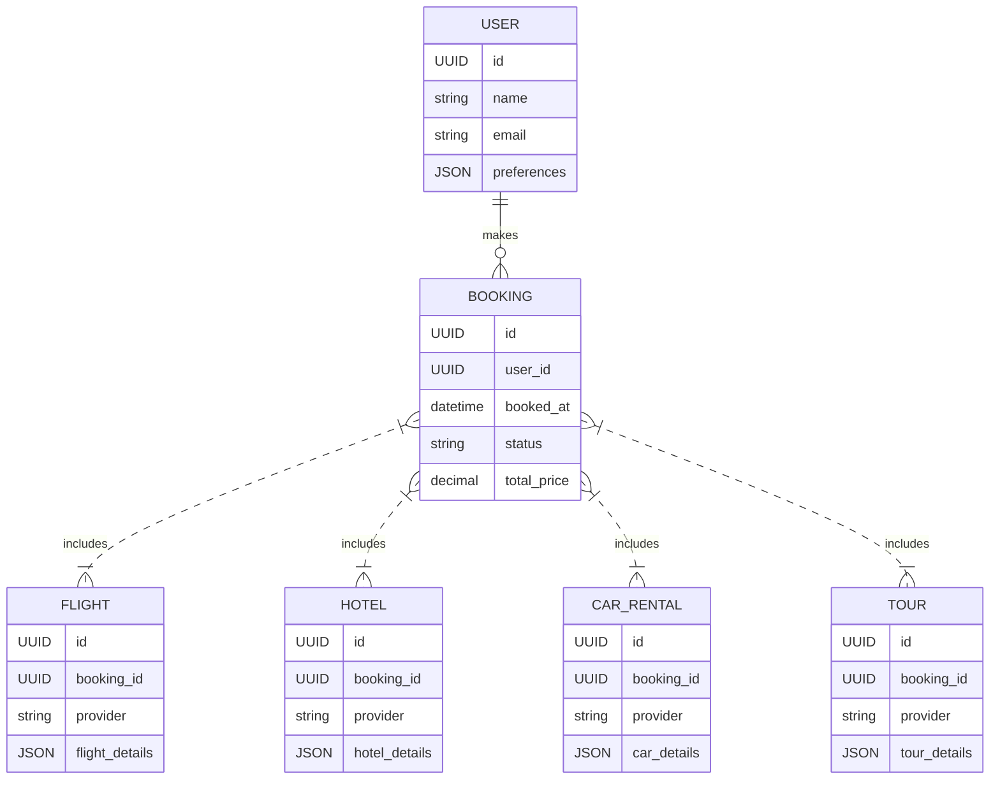

**Product Requirements Document (PRD): AI-Powered Multimodal Travel Agent**
*Built on LangChain + Open-Source Components*

---

## 1. Executive Summary

An AI-driven travel agent that lets users **chat** (text) or **speak** (voice) to plan, search, compare and book travel (flights, hotels, cars) and experiences (tours, activities). The system orchestrates third-party APIs (Amadeus, Skyscanner, Booking.com, Viator, etc.) and a large language model (LLM) via LangChain to deliver personalized, end-to-end travel booking.

---

## 2. Goals & Objectives

* **Seamless Multimodal Interaction**

  * Text chat + natural-language voice interface
* **Comprehensive Search & Booking**

  * Flights, hotels, car rentals, vacation packages, tours & local experiences
* **Personalization & Recommendations**

  * Leverage user preferences, past trips, budget constraints
* **End-to-End Automation**

  * From initial inquiry through payment confirmation
* **Open-Source Foundation**

  * Built atop LangChain for routing prompts, memory, agents

---

## 3. User Personas

| Persona                 | Description                                                       | Needs & Pain Points                                |
| ----------------------- | ----------------------------------------------------------------- | -------------------------------------------------- |
| Solo Business Traveler  | Busy professional needing optimized itineraries and confirmations | Fast result, expense integration, loyalty program  |
| Family Vacation Planner | Organizes multi-stop trips with kids                              | Flexible dates, budget management, family deals    |
| Adventure Seeker        | Seeks unique local experiences (tours, off-beat excursions)       | Curated recommendations, real-time availability    |
| Senior Leisure Traveler | Values simplicity, voice interactions                             | Large-font UI, voice guidance, trustworthy service |

---

## 4. Key Features

### 4.1 Multimodal Interface

* **Chat UI**: Web/mobile chat widget (React + Tailwind)
* **Voice UI**:

  * Speech-to-text: Whisper or Deepgram
  * Text-to-speech: Amazon Polly or openTTS
  * Voice “wake word” support

### 4.2 Core Booking Flows

1. **Discovery**: “Find me round-trip flights to Tokyo in September under \$1,200”
2. **Options Presentation**: Side-by-side comparison table (price, duration, layovers)
3. **Detail Drill-down**: “Show me hotel options near Shinjuku station”
4. **Itinerary Assembly**: Multi-booking bundling (flight + hotel + car + tours)
5. **Confirmation & Payment**:

   * Secure payment via Stripe/PayPal
   * Send booking confirmations & tickets via email/SMS

### 4.3 Personalization & Memory

* **User Profile**: Stored preferences (seat class, hotel rating, loyalty programs)
* **Contextual Memory**:

  * LangChain’s ConversationBufferMemory for session context
  * LangChain’s VectorStoreMemory for long-term preferences

### 4.4 Third-Party API Integrations

| Category           | Example APIs                     | Purpose                            |
| ------------------ | -------------------------------- | ---------------------------------- |
| Flights            | Amadeus, Skyscanner, Kiwi.com    | Search & book airfare              |
| Hotels             | Booking.com, Expedia, Hotels.com | Search & book accommodations       |
| Car Rentals        | Rentalcars.com, Hertz API        | Car rental booking                 |
| Tours/Experiences  | Viator, GetYourGuide, Klook      | Local experiences & activities     |
| Payments           | Stripe, PayPal                   | Secure payment processing          |
| Maps & Geolocation | Google Maps, Mapbox              | Map display, distance calculations |

---

## 5. Functional Requirements

| ID   | Requirement                                                                       | Priority |
| ---- | --------------------------------------------------------------------------------- | -------- |
| FR-1 | User can initiate chat or voice sessions                                          | Must     |
| FR-2 | System transcribes voice → text and synthesizes responses back to voice           | Must     |
| FR-3 | Agent conducts multi-agent API calls under the hood                               | Must     |
| FR-4 | Display search results in rich cards (flight, hotel, tours)                       | Must     |
| FR-5 | Allow user to filter & sort by price, rating, duration                            | Must     |
| FR-6 | Support booking confirmation, cancellation, and itinerary email/SMS notifications | Must     |
| FR-7 | Persist user preferences across sessions                                          | Should   |
| FR-8 | Offer proactive suggestions (“Your passport expires soon; renew now?”)            | Could    |
| FR-9 | Provide escalation to human support (live agent hand-off)                         | Could    |

---

## 6. Non-Functional Requirements

| Category     | Requirement                                                |
| ------------ | ---------------------------------------------------------- |
| Performance  | 90th-percentile response < 2s for simple queries           |
| Scalability  | Horizontally scalable microservices (Kubernetes)           |
| Availability | 99.9% uptime SLA                                           |
| Security     | OAuth2/JWT for user auth; PCI DSS compliance for payments  |
| Privacy      | GDPR-compliant data handling; user data encryption at rest |
| Localization | Multi-language support (start with EN, ES, FR, JA)         |

---

## 7. System Architecture

```mermaid
flowchart LR
  subgraph UI Layer
    ChatUI[Chat Interface]
    VoiceUI[Voice Interface]
  end

  subgraph Backend
    API_Gateway --> LangChainAgent
    LangChainAgent -->|Prompt Routing| ConversationMemory
    LangChainAgent --> MultiAgentOrchestrator
    MultiAgentOrchestrator --> FlightService
    MultiAgentOrchestrator --> HotelService
    MultiAgentOrchestrator --> TourService
    MultiAgentOrchestrator --> PaymentService
  end

  subgraph External APIs
    FlightService --> AmadeusAPI
    HotelService --> BookingAPI
    TourService --> ViatorAPI
    PaymentService --> StripeAPI
    VoiceUI -->{STT/TTS Services}
  end

  ChatUI --> API_Gateway
  VoiceUI --> API_Gateway
```

---

## 8. Data Model (High Level)



---

## 9. Technology Stack

* **Core Framework**: LangChain (Agents, Memory, Chains)
* **LLM Providers**: OpenAI GPT-4o + open-source LLM fallback (e.g. Llama2)
* **Backend**: Python + FastAPI, Docker/Kubernetes
* **Frontend**: React (Chat UI), React Native (Mobile), WebRTC for voice
* **Datastores**: PostgreSQL (bookings), Redis (session), Pinecone/Weaviate (vector memory)
* **Authentication**: OAuth2 / JWT via Auth0 or Keycloak
* **CI/CD**: GitHub Actions, Terraform for infra

---

## 10. User Stories (Sample)

1. **As a** user, **I want** to say “Book me a flight to Paris next Friday” **so that** I can get options hands-free.
2. **As a** user, **I want** to filter hotels by “4 stars and above under \$200/night” **so that** I find high-quality stays within my budget.
3. **As a** user, **I want** confirmation emailed and messaged to me **so that** I have all my trip details.
4. **As a** user, **I want** the agent to remember my seat-preference and loyalty number **so that** I don’t repeat myself each time.

---

## 11. Success Metrics

* **Adoption**: ≥10% of sign-ups complete a booking within first session
* **Conversion**: ≥5% chat sessions result in a booking
* **Latency**: Median response time <1.5s
* **CSAT**: ≥4.5/5 average post-trip survey rating

---

## 12. Risks & Mitigations

| Risk                          | Mitigation                                                 |
| ----------------------------- | ---------------------------------------------------------- |
| Inconsistent API behavior     | Build resilient retry & fallback logic                     |
| Voice accuracy in noisy env’t | Offer a “confirm” step & display transcription preview     |
| Payment failures              | Integrate multiple payment gateways, clear error messaging |
| Data privacy concerns         | End-to-end encryption, explicit user consent flows         |

---

## 13. Next Steps

1. **Proof-of-Concept**: End-to-end “flight search + book” via LangChain agent
2. **API Sandbox Integration**: Connect to Amadeus & Booking sandbox keys
3. **Prototype UI**: Chat + voice demo with basic memory
4. **User Testing**: Validate multimodal flows with target personas
5. **Iterate & Expand**: Add tours, car rentals, payment flows, scale

---
